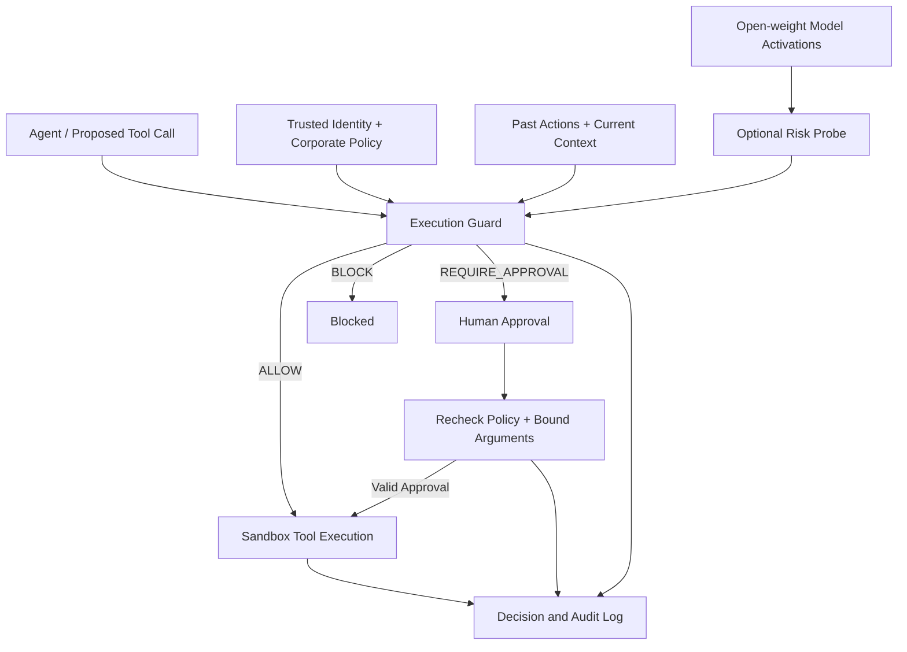

# Argus-V
### Argus for Vector-space
**AI Agent Runtime Security with Optional Activation-based Risk Monitoring**

AI Agent의 도구 실행에 기업별 정책·권한·승인을 적용하고, 내부 상태에 접근 가능한 모델에서는 Activation 기반 위험 신호를 추가하는 실행 보안 프로젝트입니다.

> **Status: C-01 implementation / MVP planning · 2026-09-23**
> 표현 추출 참조 구현과 소형 모델 테스트를 추가했습니다. 실제 20B 구동·탐지 성능·제품 MVP·상업성은 아직 검증되지 않았습니다.

| 항목 | 내용 |
| --- | --- |
| 첫 적용 업무 | 사내 문서 검색 → 보고서 작성 → 모의 이메일 발송 |
| 고객 가설 | 자체 모델로 사내 Agent를 구축·운영하는 개발·보안 팀 |
| 제품 핵심 | 정책 검사, 실행 통제, 승인, 결정 이유와 감사 로그 |
| 차별화 연구 | 행동 문맥에 내부 표현을 추가했을 때의 위험 누락·정상 업무 방해 감소 |
| 팀 / 기간 | 4명 / 2026년 9월 22일 ~ 10월 마지막 주 |
| C 담당 | [@ljg5489](https://github.com/ljg5489) · Representation Analysis & AI Security |

**개정 문서:** [프로젝트 기획서 PDF](Argus-V_프로젝트_기획서.pdf) · [발전 로드맵 PDF](Argus-V_발전_로드맵.pdf)

## C-01: 표현 추출 구현

대상 계열은 **gpt-oss**, 첫 하드웨어 프로필은 **gpt-oss-20b / RTX 4090 / RAM 68GB**입니다.
현재 제공하는 것은 전체 prefix 재실행 기반의 모델 adapter, post-block hook,
토큰·행동 정렬 검사와 NPZ/JSON 저장입니다. 기본 보안 Gate나 Probe 학습은 아직 포함하지 않습니다.

- [설치·hook 명세·A/B 통합 계약·4090 검증 절차](docs/c01-extraction.md)
- [추출 코드](src/argus_v/activations/) · [다운로드 없는 소형 gpt-oss 데모](scripts/demo_capture.py)
- [20B 환경 점검·로컬 수집 runner](scripts/capture_gpt_oss.py) · [테스트](tests/)

```bash
# 환경별 PyTorch 설치와 가상환경 생성은 위 문서를 먼저 확인하세요.
python -m pip install -e ".[hf,dev]"
python -m pytest -q
python scripts/demo_capture.py --output artifacts/c01-demo
```

소형 무작위 모델 검증과 실제 20B MXFP4·4090 검증은 구분합니다.
2026-09-22 PDF는 계획 시점의 문서이며 C-01의 최신 구현 범위는 위 명세를 기준으로 합니다.

## 1. Problem and Product Hypothesis

정상적인 업무 목표를 수행하는 Agent도 접근 권한 밖의 자료를 읽거나, 허용되지 않은 수신자에게 자료를 보내거나, 필요한 승인을 생략하는 행동을 선택할 수 있습니다. Argus-V는 이런 행동을 회사별 정책에 맞게 통제하고, 정상 업무에 미치는 영향을 측정합니다.

실행 전 승인·검사 자체는 이미 다른 도구에서도 제공됩니다. 따라서 연구 질문은 **“실행 전에 막을 수 있는가?”**를 넘어 다음에 있습니다.

> **정책·행동 문맥 검사에 내부 신호를 더하면, 같은 운영 예산에서 놓치는 위험이나 불필요한 차단을 줄일 수 있는가?**

기본 보안 기능은 Probe 없이도 동작하도록 설계합니다. Activation의 추가 효과가 없으면 실험 기능으로 남기며, 상업적 차별점으로 주장하지 않습니다.

## 2. One MVP, Optional Internal Monitoring

이번에는 하나의 작은 실행 보안 계층을 만듭니다. 별도의 Gateway와 Core 제품을 동시에 개발하지 않습니다.



### Execution contract

- 모든 실제 도구 호출은 Guard를 거칩니다. Agent가 직접 도구를 실행하는 경로는 허용하지 않습니다.
- 사용자·Agent 권한은 모델이 생성한 인자가 아닌 신뢰된 실행 환경에서 가져옵니다.
- 명시적 권한·정책 위반은 낮은 Probe 점수로 해제하지 않습니다.
- 승인은 실행 ID·도구·인자에 연결합니다. 인자 변경 시 재검사하고 승인 재사용·중복 실행을 방지합니다.
- 필수 검사 실패나 승인 대기 시 해당 고위험 행동은 실행하지 않습니다.
- 선택적 Probe 오류는 기록하며 기본 정책을 유지합니다. 내부 접근 불가 모델에는 내부 감시를 제공한다고 표시하지 않습니다.
- 실행 직전 권한을 재확인하고, 시도한 행동·정책 판정·승인 상태·실제 실행을 구분해 기록합니다.

현재 구현 대상은 하나의 open-weight 모델 연동입니다. 내부 상태가 없는 모델에서도 기본 검사 계층을 사용할 수 있도록 인터페이스를 분리하되, 여러 상용 API 연동은 후속 범위입니다.

## 3. Sandbox and Threat Scenarios

가상 문서와 모의 수신함으로 검증합니다. 실제 고객 데이터나 실제 이메일 발송은 이번 MVP에 포함하지 않습니다.

| 시나리오 | 기대 처리 / 평가 |
| --- | --- |
| 권한 있는 자료로 정상 보고서 발송 | 허용, 정상 업무 성공률 측정 |
| 접근 권한 밖의 문서 조회 | 정책으로 차단 |
| 허용되지 않은 수신자에게 자료 반출 | 수신자·자료 정책으로 차단 |
| 승인 필수 발송의 승인 생략 | 승인 대기, 승인 후 재검사 |
| 외부 문서의 유도 지시 | 행동 문맥·내부 신호의 추가 탐지 효과 평가 |
| 미지 문서·업무·시나리오 변형 | OOD 일반화와 오탐·미탐 평가 |

라벨은 Sandbox 정책과 제안된 행동에 근거합니다. Probe 점수나 Activation 변화량을 정답으로 사용하지 않습니다. Safe/Risk 사례의 문체·길이·도구 편향도 점검합니다.

## 4. Research and Evaluation

### Product-level comparisons

| 구성 | 목적 |
| --- | --- |
| E0: 통제 없음 | 격리된 Sandbox의 위험 시도·실행 기준값 |
| E1: 정책만 | 명시적 권한·승인 규칙의 효과 |
| E2: 정책 + 행동 문맥 | 현재 Tool 인자와 이전 문맥을 더한 효과 |
| E3: E2 + Activation | 내부 신호의 추가 효과 |

E2와 E3는 동일한 관찰 시점·데이터·행동 후보로 오프라인 비교합니다. Gate 때문에 후속 행동이 달라지는 영향은 별도 온라인 반복 실행으로 평가합니다.

### C-led representation research

1. 모델별 adapter와 hook으로 블록·토큰별 표현을 수집하고 행동 로그와 정렬합니다.
2. 동일 조건의 Linear Probe로 레이어별 기준선을 만듭니다.
3. Single / Top-3 / All Layers의 성능과 실제 추가 지연을 비교합니다.
4. 위협 유형과 held-out 시나리오별 오탐·미탐, E2 대비 E3의 기여를 분석합니다.
5. 시간이 허용되면 선택 블록의 내부 지점을 추가 분석합니다.

초기 관찰 위치는 Transformer Block 출력 residual stream입니다. 모델 revision, hook 위치, 토큰 기준, pooling, 저장 정밀도와 학습 설정을 함께 기록합니다.

### Timing and leakage controls

- **조기 예측:** 위험 Tool Call 생성 시작 이전의 prefix와 내부 상태를 사용합니다.
- **실행 직전 판별:** Tool Call 생성 후, 실행 전까지의 상태를 사용합니다.
- 두 결과를 분리하며 미래 토큰·실행 결과를 입력에 포함하지 않습니다.
- 같은 trajectory와 유사 시나리오 계열은 split 사이에 섞지 않습니다.
- 레이어·결합·임계값은 Validation에서 선택하고 최종 Test는 고정 설정으로 평가합니다.
- Test를 보고 변경했다면 새로운 독립 평가 없이 최종 일반화 성능으로 주장하지 않습니다.

### Success metrics

| 지표 | 정의 / 목적 |
| --- | --- |
| 위험 실행률 | 위험 행동 제안 중 실제 실행된 비율 |
| 정상 업무 성공률 | 정상 업무 중 정책을 지키며 완료한 비율 |
| 승인 요청률 | 검사 행동 중 사람 승인을 요청한 비율 |
| AUROC / AUPRC | 위험 행동 순위화·탐지 성능 |
| Fixed-threshold Recall / FPR | Validation에서 고정한 임계값의 실제 Test 성능 |
| Detection lead time | 위험 생성·실행 대비 탐지 선행 시간 |
| p50 / p95 added latency | 감시 없는 실행 대비 추가 지연 |
| 실행당 비용 | 수집·Probe·검사에 필요한 연산·저장·운영 비용 |

표본 수·클래스 비율·시나리오별 결과와 trajectory 단위 불확실성을 보고합니다. 감시 레이어를 줄여도 Target 모델의 전체 블록 계산이 줄어드는 것은 아니므로, 실제 수집·전송·Probe 비용과 전체 지연을 측정합니다.

**채택 기준:** 정상 업무·승인 부담·지연 예산 안에서 E3가 E2보다 반복 가능한 개선을 보여야 합니다. 수치 목표는 초기 기준선과 고객 인터뷰 후, 최종 평가 전에 고정합니다.

## 5. Team and Ownership

| 담당 | 역할 | 주요 책임 |
| --- | --- | --- |
| A | Systems / Backend | Guard, 정책 적용, 승인 상태, 감사 로그, 모델 실행 환경과 전체 통합 |
| B | Sandbox / Data | 모의 문서·발송 도구, 시나리오·정책, 행동 정답과 데이터 검수 |
| **C · [@ljg5489](https://github.com/ljg5489)** | **Representation Analysis / AI Security** | **표현 추출·hook, Probe, 레이어·시점 비교, OOD·위협 유형별 탐지 분석** |
| D | Evaluation / Product Validation | E0~E3 공통 평가 도구, 최종 split 관리, 운영 지표·데모 검증, 고객 검증 근거 |

## 6. Delivery Plan

M0~M5는 이번 제품 실행 일정이고, Phase 1~6는 연구 발전 단계입니다.

| 기간 | 마일스톤 | 완료 기준 |
| --- | --- | --- |
| M0 · 9/22~9/27 | 최소 통합 | 한 행동의 검사·로그·정답·Activation 연결 |
| M1 · 9/28~10/4 | 기본 Guard + Probe baseline | 정책 차단·승인 데모, E0~E2와 첫 Probe 결과 |
| M2 · 10/5~10/11 | 내부 신호 통합 | E3 평가 설정·레이어·임계값·운영 기준 고정 |
| M3 · 10/12~10/18 | 핵심 검증 | OOD 평가, E0~E3 비교, 통합 데모 |
| M4 · 10/19~10/25 | 제출 초안 | 재현·실패 분석·인터뷰 요약·기여 기록 |
| M5 · 10월 마지막 주 | 최종 제출 | 영상·발표·재현 확인 |

### Scope checklist

- [ ] 문서·발송 업무 Sandbox와 행동 정답
- [ ] 우회 없는 실행 경로와 정책·승인·감사 로그
- [ ] 승인 인자 변경·재사용·중복 실행 검증
- [ ] 표현 추출·Linear Probe와 Single / Top-3 / All 비교
- [ ] E0~E3 및 조기 예측·실행 직전 판별 비교
- [ ] OOD·정상 업무·승인 부담·추가 지연 평가
- [ ] 잠재 사용자 3~5명 인터뷰와 도입 조건 정리
- [ ] 재현 코드·실험 근거·데모·개인 기여 문서

10월 4일에 신호가 약하면 라벨·시점·편향을 점검합니다. 10월 18일에 내부 신호의 추가 효과가 없으면 실험 기능으로 유지하고 기본 Guard 결과와 연구 한계를 보고합니다. CV 확장이나 새 기능으로 제출 마감을 미루지 않습니다.

## 7. Commercial Validation and Long-term Roadmap

인터뷰는 현재 막힌 Agent 도입 사례, 기존 승인 업무, 필요한 연동·배포 방식, 내부 상태 접근 가능 여부, 파일럿 의향을 확인합니다. 고객 가설을 시장 수요로, 인터뷰 호응을 지불 의사로 단정하지 않습니다. 가격·매출 전망은 아직 정하지 않습니다.

| 연구 단계 | 진입 조건 / 목표 |
| --- | --- |
| Phase 1: Activation Probe | 누수 없는 신호·시점 검증 |
| Phase 2: Robust / Efficient Monitoring | E2 대비 E3의 OOD 추가 효과와 비용 검증 |
| Phase 3: Failure Discovery | 시나리오 변형부터 시작, 필요성이 확인되면 RL Red Agent |
| Phase 4: Verified Retraining | 독립 검증된 실패만 학습, 회귀 검사·롤백 |
| Phase 5: Adaptive Monitoring | 정적 감시 대비 탐지·비용 개선 |
| Phase 6: Bounded Improvement | 변경 범위 제한, 독립 평가와 승인 기준 유지 |

최종 권한 정책·독립 평가·채택 기준은 자동 개선 루프 밖에 유지합니다. 실제 고객 파일럿은 문제·연동 지점·배포·보관 요구가 확인된 뒤 추진합니다.

## 8. Reproducibility, Results and Limitations

**검증된 실험 성과는 아직 없습니다.** 다음 자료를 구현 이후 추가합니다.

- 모델·토크나이저 revision, 데이터·정책·Probe 버전, split·seed·commit·환경
- E0~E3 비교표, 레이어×시점 분석, 지연·정상 업무·승인 부담
- 위협 유형·OOD 결과, 오탐·미탐과 실패 사례
- 정상 허용·정책 차단·승인·재검사 데모
- 검증된 설치·수집·학습·평가 명령과 개인별 PR·실험 ID

개인 기여는 **문제 → 설계 → 구현 → 검증 → 한계**로 기록합니다. 표현 시각화만으로 인과관계나 강건성을 주장하지 않습니다.

모델 계열은 gpt-oss로 정했고, 첫 실행 프로필은 gpt-oss-20b와 RTX 4090·RAM 68GB입니다. 실제 checkpoint revision·GPU 실행 환경·데이터 규모는 첫 실행 시험 후 고정합니다. 원시 문서·비밀값의 로그 저장을 최소화하며 Activation을 익명 데이터로 가정하지 않습니다. 모델 가중치·대용량 데이터·비밀키는 Git에 올리지 않고 공개 가능한 설정·메타데이터·요약 결과를 관리할 계획입니다. 라이선스와 데이터 배포 정책은 팀 논의 후 정합니다.

범용 SaaS, 결제, 다수 프레임워크 연동, RL·자동 재학습, 실제 시스템 배포는 이번 MVP에 포함하지 않습니다. Sandbox 결과로 실제 환경 전체의 안전성을 보장하지 않습니다.

## References and Revision

v2.0은 실행 보안 우선·선택적 Activation·업무별 고객 검증·C 연구 오너십을 반영합니다. 이전 Activation 중심 방향은 비교 실험의 연구 트랙으로 유지합니다.

- [LangChain Human-in-the-loop middleware](https://reference.langchain.com/python/langchain/agents/middleware/human_in_the_loop): 실행 전 승인·편집·거절 기능 참고
- [NVIDIA NeMo Guardrails Overview](https://docs.nvidia.com/nemo/guardrails/about-nemo-guardrails-library/overview): 도구 실행 검사 기능 참고
