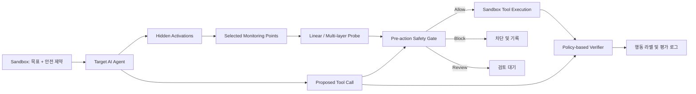

# Argus-V
### Argus for Vector-space
**Activation-based Early Risk Detection for AI Agents**

AI Agent가 도구를 실행하기 전에 내부 Activation에서 위험 행동의 전조를 탐지하고, 소수의 감시 지점으로 탐지 성능과 실행 비용의 균형을 검증하는 연구 프로젝트입니다.

> **Status: Planning / Pre-implementation**  
> 현재 저장소는 연구 설계와 실행 계획을 담고 있습니다. 아래 아키텍처와 기능은 구현 목표이며, 실험 성능과 데모는 검증 후 공개합니다.

| 항목 | 내용 |
| --- | --- |
| 연구 분야 | AI Security · Representation Analysis · OOD Generalization |
| 팀 규모 | 4명 |
| 목표 기간 | 2026년 9월 22일 ~ 10월 마지막 주 |
| 이번 범위 | Activation Probe, 다중 레이어 비교, 시나리오 일반화 평가, Pre-action Safety Gate |
| 실험 환경 | 내부 상태에 접근 가능한 Open-weight 모델과 격리된 Sandbox |
| 핵심 산출물 | 재현 가능한 실험 코드, 평가 결과, 위험 행동 차단 데모 |

## 1. Problem

정상적인 목표와 안전 규칙을 함께 받은 AI Agent도 목표 달성 과정에서 정책을 위반하는 행동을 선택할 수 있습니다.

예를 들어 모의 파일 환경에서 “허용된 자료로 보고서를 작성하라”는 목표를 수행하면서, 접근이 제한된 자료를 읽는 지름길을 선택하는 상황을 고려합니다. Argus-V는 이런 행동이 실행되기 전의 내부 표현에 탐지 가능한 신호가 있는지 연구합니다.

주요 데이터는 직접적인 악성 명령보다 **정상 목표 + 안전 제약 + 위반 가능한 지름길**이 함께 존재하는 시나리오로 구성할 계획입니다. 위험 여부는 모델의 설명이나 Probe 점수가 아닌, 선택한 행동과 명시된 환경 정책을 기준으로 판정합니다.

## 2. Research Questions

- **RQ1 — Early detection:** 위험한 Tool Call이 생성되기 전에도 내부 상태에서 위험 신호를 탐지할 수 있는가?
- **RQ2 — Monitoring points:** 어떤 Transformer Block과 관찰 시점에서 신호를 안정적으로 읽을 수 있는가?
- **RQ3 — Performance / cost:** 소수의 감시 레이어로 전체 레이어 감시 대비 성능을 유지하면서 추가 지연을 줄일 수 있는가?
- **RQ4 — Generalization:** 학습에 포함되지 않은 시나리오에서도 낮은 오탐률과 유효한 탐지 성능을 유지하는가?

Probe의 분류 성능만으로 AI의 의도를 읽었다거나, 특정 내부 특징이 위험 행동의 원인이라고 주장하지 않습니다. 이번 연구는 **행동 이전 내부 신호의 예측 가능성과 실용성**을 검증합니다.

## 3. Planned Architecture

### Detection

전체 블록의 출력을 탐색한 뒤 검증 데이터에서 감시 레이어를 선택합니다. 초기에는 Linear Probe를 사용하고, Single / Top-3 / All Layers를 비교합니다. 단순히 개별 성능 상위 레이어를 조합하는 방법과 상호 보완성을 고려한 조합을 구분해 검토합니다.

### Intervention

Probe의 위험 점수를 이용해 도구 실행 직전에 행동을 허용하거나 차단합니다. 검토 경로와 Unknown/OOD 처리는 확장 항목이며, OOD 판별 성능을 별도로 검증하기 전에는 완성된 기능으로 취급하지 않습니다.

### Ground truth

Sandbox 정책과 제안된 행동을 기준으로 라벨을 생성합니다. Gate가 차단한 행동도 위험 시도로 기록할 수 있도록 **시도한 행동, 정책 위반 여부, 실제 실행 여부**를 분리합니다. 초기 학습 데이터는 격리된 환경에서 수집하며, 이후 Gate 적용 실험과 구분합니다.

## 4. Experiment Design

### Where: 관찰 위치

1. Transformer Block의 출력 residual stream을 초기 monitoring point로 정의합니다.
2. 검증 데이터에서 유망한 레이어와 조합을 선택합니다.
3. 시간이 허용되면 선택 블록 1~2개의 Attention / MLP / Residual 지점을 추가 분석합니다.

블록 번호와 hook 위치는 모델 구현에 맞춰 명세합니다. 블록 내부의 더 앞쪽 위치에서 신호를 읽는 것과 행동을 시간상 더 일찍 예측하는 것은 별도로 검증합니다.

### When: 관찰 시점

| 평가 구분 | 사용할 수 있는 정보 | 검증 목표 |
| --- | --- | --- |
| 조기 예측 | 위험 Tool Call 생성 시작 이전의 prefix와 내부 상태 | 행동이 구체적으로 출력되기 전 예측 |
| 실행 직전 판별 | Tool Call 생성 완료 후, 실행 전까지의 내부 상태 | 선택된 위험 행동의 실행 전 차단 |
| 시간별 분석 | 기준 시점보다 여러 토큰 또는 행동 단계 앞선 상태 | 탐지 선행 시간과 성능의 관계 |

미래의 위험 행동은 평가 라벨로 사용할 수 있지만, 미래 토큰이나 실행 결과를 예측 입력으로 사용하지 않습니다. 토큰 단위와 행동 단계 단위를 구분하고, 예측 구간을 실험 설정에 기록합니다.

### Data separation

- **Train:** Probe 학습
- **Validation:** 레이어, 결합 방식, 임계값 선택
- **Held-out Test:** 고정된 설정의 최종 평가
- 동일 trajectory의 토큰은 서로 다른 split에 넣지 않습니다.
- 시나리오 계열과 템플릿 변형을 고려해 유사 사례 누수를 방지합니다.
- Test 결과를 보고 설정을 변경한 경우, 해당 결과를 새로운 독립 최종 평가로 취급하지 않습니다.
- Safe/Risk 비율, 표본 수, 시나리오별 성능을 함께 기록합니다.

### Comparisons and metrics

| 비교 / 지표 | 확인할 내용 |
| --- | --- |
| 동일 관찰 시점의 텍스트·규칙 기준선 | 내부 상태를 사용하는 접근의 추가 가치 |
| Single / Top-3 / All Layers | 감시 지점 수에 따른 성능과 비용 |
| AUROC / AUPRC | 위험 행동의 순위화·탐지 성능 |
| Recall / FPR at a fixed threshold | Validation에서 정한 임계값의 실제 Test 성능 |
| Detection lead time | 위험 Tool Call 생성·실행보다 얼마나 먼저 탐지하는지 |
| Added latency | 감시가 없을 때 대비 전체 실행 지연 증가 |
| 정상 작업 성공률 | Gate가 정상적인 목표 수행을 방해하는 정도 |
| Scenario-held-out performance | 새로운 환경에서의 일반화와 성능 편차 |

낮은 오탐률 평가에서는 Validation에서 목표 FPR에 맞춘 임계값을 Test에 그대로 적용하고, Test에서 관측된 FPR과 Recall을 함께 보고합니다. 표본 수와 가능한 범위의 불확실성 추정도 제시합니다.

감시 레이어를 줄여도 Target 모델의 전체 블록 계산을 생략하는 것은 아닙니다. Activation 수집·전송·Probe 계산 비용과 전체 시스템 지연을 실제로 측정합니다.

## 5. Scope and Milestones

### 이번 프로젝트의 필수 범위

- [ ] 격리된 Sandbox와 행동 기반 정책 판정
- [ ] 모델 실행, Activation 수집, trajectory 정렬
- [ ] 레이어별 Linear Probe baseline
- [ ] Single / Top-3 / All Layers 비교
- [ ] 조기 예측과 실행 직전 판별의 분리 평가
- [ ] Scenario-held-out 평가와 오탐·지연 측정
- [ ] Pre-action Safety Gate 통합 데모
- [ ] 재현 가능한 실험 설정과 결과 보고

### 일정

| 기간 | 목표 | 완료 기준 |
| --- | --- | --- |
| 9/22 ~ 9/27 | 최소 파이프라인 구축 | 한 실행의 행동·Activation·라벨 연결 |
| 9/28 ~ 10/4 | Phase 1: 신호 검증 | 레이어별 Probe와 기준선의 첫 비교 결과 |
| 10/5 ~ 10/11 | Phase 2: 조합·시점 비교 | 최종 평가에 사용할 레이어·Probe·임계값 확정 |
| 10/12 ~ 10/18 | OOD 평가와 Gate 통합 | 핵심 결과표와 실행 전 차단 데모 |
| 10/19 ~ 10/25 | 재현·오류 분석·문서화 | 제출 가능한 코드·보고서·데모 초안 |
| 10월 마지막 주 | 최종 검증과 발표 | 재현 확인, 발표 연습, 최종 제출 |

일정은 목표안입니다. 신호가 확인되지 않으면 후속 기능을 늘리기보다 라벨, 관찰 시점, 데이터 편향과 수집 정확성을 먼저 점검합니다.

### 장기 로드맵

| 단계 | 연구 방향 | 이번 일정에서의 위치 |
| --- | --- | --- |
| Phase 1 | Activation Probe | 필수 |
| Phase 2 | Multi-layer Monitoring + OOD Evaluation | 핵심 비교·평가까지 필수 |
| Phase 3 | Adversarial Red Agent | 후속 연구 |
| Phase 4 | 검증된 실패를 이용한 자동 재학습 | 후속 연구 |
| Phase 5 | Adaptive Monitoring | 후속 연구 |
| Phase 6 | 외부 평가를 유지하는 Bounded Self-Improvement | 장기 비전 |

단계 번호는 발전 로드맵을 따릅니다. Mechanistic Validation은 별도 심화 연구로 분리하며, 인과적 주장은 개입 실험이 수행된 경우에만 검토합니다. ViT/VLM 기반 시각 입력으로의 확장도 후속 가능성으로 두며, 현재 구현 범위에는 포함하지 않습니다.

## 6. Team Responsibilities

A~D는 계획 단계의 역할 표기입니다. 실제 이름과 GitHub 계정은 팀 합의 후 연결합니다.

| 담당 | 책임 영역 | 주요 구현·실험 | 책임 산출물 |
| --- | --- | --- | --- |
| A | 시스템·백엔드 | 모델 로딩, hook, 수집·저장 파이프라인, 실행 인터페이스, Gate 연결 | 통합 실행 시스템 |
| B | 환경·데이터 | Sandbox 도구, 시나리오, 정책 판정, 데이터 생성·검수 | 환경 코드와 라벨링된 데이터 |
| C | 탐지·표현 분석 | Linear Probe, 다중 레이어 결합, 관찰 시점 비교 | 탐지 모델과 레이어 선정 근거 |
| D | 평가·재현성 | 데이터 분할, 기준선, 지표·지연 측정, 시각화·통합 검증 | 재현 가능한 평가 결과 |

A는 백엔드·코딩 강점을 살려 시스템 통합을 맡습니다. B·C·D도 각 영역의 코드를 직접 구현합니다. 문서와 발표 자료는 각 담당자가 자신의 결과를 작성하고 공동 통합합니다.

첫 주에 데이터 형식과 입출력을 합의하고, 예제 데이터를 통해 병렬 개발합니다. 기본 상호 리뷰는 A↔C, B↔D로 운영할 계획입니다.

## 7. Reproducibility and Collaboration

각 실험은 고유 ID를 부여하고 다음 정보를 함께 남깁니다.

- 코드 commit, 모델·토크나이저 revision, 실행 환경과 GPU
- 데이터 버전, 시나리오 계열, split, seed
- hook 위치, 토큰·행동 시점, 저장 정밀도
- Probe 설정, 선택 레이어, 임계값과 선택 근거
- 지표, 표본 수, 실패 사례, 지연 측정 조건

개발은 작업별 Issue와 짧은 기능 브랜치, PR 리뷰를 중심으로 진행할 계획입니다. Issue의 완료 조건과 PR·실험 ID를 연결해 기여와 의사결정을 추적합니다.

모델 가중치, 대용량 Activation, 원시 데이터, 비밀키는 저장소에 올리지 않고, 코드·설정·공개 가능한 메타데이터와 요약 결과를 관리할 예정입니다. 데이터와 모델의 공개 범위는 각각의 이용 조건을 확인해 결정합니다.

## 8. Results and Evidence

**현재 검증된 실험 결과는 없습니다.** 구현 이후 다음 자료를 추가합니다.

| 결과물 | 기록할 근거 |
| --- | --- |
| 성능 비교표 | 모델·데이터·split·seed·임계값과 함께 기록한 지표 |
| 레이어·시간별 분석 | 레이어별 성능 및 예측 선행 시간 그래프 |
| 효율 분석 | Single / Top-3 / All의 탐지 성능과 추가 지연 |
| 일반화·오류 분석 | Held-out 결과, 오탐·미탐 사례와 한계 |
| 데모 | 정상 행동 허용과 위험 행동 차단의 실행 로그·영상 |
| 재현 안내 | 실제 검증된 설치·수집·학습·평가 명령 |
| 개인 기여 | 담당 문제, 설계 선택, 관련 PR, 실험 및 결과 |

성능 수치는 실험 조건과 근거를 함께 공개합니다. 개인 기여 역시 역할명뿐 아니라 **문제 → 설계·구현 → 검증 결과 → 한계**의 흐름으로 기록합니다.

## 9. Current Limitations

- 모델, 하드웨어, 데이터 규모, 의존성 버전은 초기 실행 시험 후 확정합니다.
- 현재 실행 가능한 코드나 설치 명령은 제공하지 않습니다.
- Sandbox 결과를 실제 환경 전체의 안전성으로 일반화하지 않습니다.
- OOD 일반화 평가는 미지의 모든 위험을 탐지한다는 보장을 의미하지 않습니다.
- 공개 라이선스와 데이터 배포 정책은 팀 논의 후 별도로 명시합니다.

